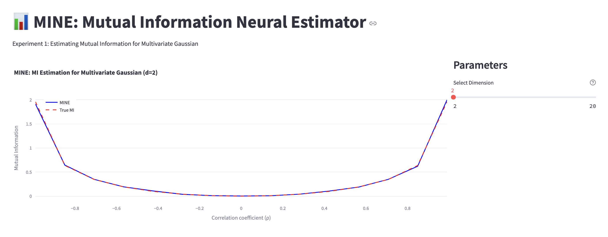

# dsc-261-project-f24
DSC 261 Group 2 Final Project Repository

## Experiment 1
### Mutual Information estimation between correlateed Gaussian distributions

The paper does this experiment in Section 4.1 to ensure that their code for MINE works as expected.

We have incorporated all the architecture decisions mentioned in the paper- from componentwise correlation while sampling gaussian distributions, to making to model automatically adaptive (more data /iterations for higher dimensions), to stabilizing gradients using exponential moving averages of gradient values across epochs.

These experiments were done in the Ipython notebook present at `MINE-experiments-nb.ipynb`. This notebook contains our version of the neural network code foe the MINE [paper](https://arxiv.org/pdf/1801.04062). 

The results are present in `./results` directory.

In order to run the web app displaying interactive results from dimension 2 to 20, follow the below steps:

#### Step 1: Install requirements
`
pip install -r requirements.txt
`
#### Step 2: Run the web app locally
`
streamlit run app.py
`

