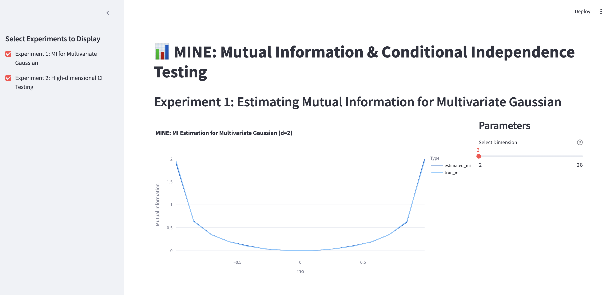
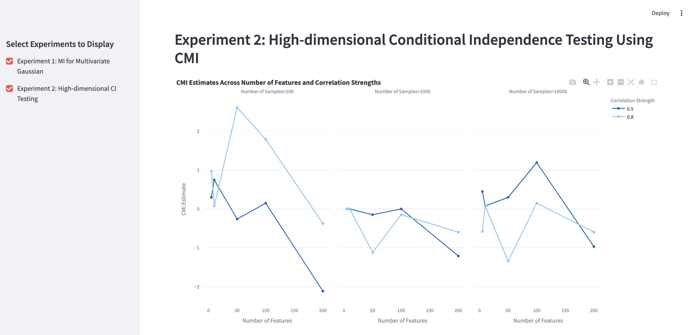

# dsc-261-project-f24
DSC 261 Group 2 Final Project Repository

## Experiment 1
### Mutual Information estimation between correlateed Gaussian distributions

The paper does this experiment in Section 4.1 to ensure that their code for MINE works as expected.

We have incorporated all the architecture decisions mentioned in the paper- from componentwise correlation while sampling gaussian distributions, to making to model automatically adaptive (more data /iterations for higher dimensions), to stabilizing gradients using exponential moving averages of gradient values across epochs.

These experiments were done in the Ipython notebook present at `MINE-experiments-nb.ipynb`. This notebook contains our version of the neural network code foe the MINE [paper](https://arxiv.org/pdf/1801.04062). 

The results are present in `./results` directory.

## Experiment 2
### MINE for CMI Estimation
This is a an implementation we have tried by modifying MINE to get Conditional Mutual Information which can be used for Conditional Independence testing. There were some issues in the netwrok architecture and the data generating process but nevertheless, the results when plotted were as expected upto some extent and we need further analysis to prove the theoretical framework we have tried.
These experiments were done in the Ipython notebook present at `CMI_CI_Testing.ipynb`.

In order to run the web app displaying interactive results from dimension 2 to 20, follow the below mnetioned steps.

## Installation steps
#### Step 1: Install requirements
`
conda create --name grp_2_env python=3.11.0 
` 
`
conda activate grp_2_env
` 
`
pip install -r requirements.txt
`
#### Step 2: Run the web app locally
`
streamlit run app.py
`
## Directory overview
- Experiments ipython Notebook: `MINE-experiments-nb.ipynb`
- Final MINE architecture python script: `mine_final_architecture.py`
- Practical Implementation of MINE for CMI Estimation for CI testing: `CMI_CI_Testing.ipynb`
- Results directory: `./results`
- Streamlit web app for results: `app.py`
